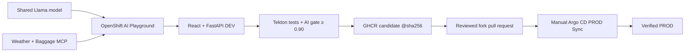

# Packmate Agent

Packmate is an AI travel assistant and a beginner Red Hat Demo Platform workshop. Participants prototype with a shared Llama model and MCP tools in OpenShift AI, validate the integrated React/FastAPI application in DEV, run an AI-aware Tekton Pipeline, publish an immutable GHCR candidate, promote its digest through a reviewed pull request, and manually synchronize PROD with Argo CD.

The standard learning path is:

**RHDP sandbox → OpenShift AI project and Workbench → Playground → DEV → Tekton → GHCR digest → pull request → manual Argo CD Sync → verified PROD**

## Workshop safety model

- `Lindagh1/packmate-agent` is the read-only canonical source.
- Every participant works in a GitHub fork.
- `make configure-participant` derives local settings from fork remote `origin` and disables pushes to canonical `upstream`.
- GitHub and GHCR credentials never belong in `config/sandbox.env`, scripts, documentation, or Git history.
- Argo CD owns all Git-tracked DEV and PROD runtime resources.
- DEV may reconcile automatically; PROD always requires a manual Sync.
- The Pipeline validates and publishes but never deploys PROD.
- Production promotion changes only the backend image `newName` and immutable `digest` in `deploy/overlays/prod/kustomization.yaml`.

## Environments

| Environment | Namespace | Contents | Delivery behavior |
|---|---|---|---|
| DEV | `packmate-lab` | OpenShift AI project, Workbench, Playground assets, Tekton, React/FastAPI, MCP | Argo CD reconciles automatically |
| PROD | `packmate-prod` | Runtime React/FastAPI and MCP services only | Argo CD manual Sync only |

The shared `llama-32-3b-instruct` model remains in `my-first-model`; the workshop does not deploy another model.

## Participant quick start

After creating `packmate-lab` and cloning the participant fork into the Workbench:

```bash
make configure-participant
make configure-git \
  PACKMATE_GIT_NAME='Your Name' \
  PACKMATE_GIT_EMAIL='you@example.com'
make verify-demo-fork
make prepare-demo-baseline
make configure-promotion-registry
make verify-promotion-registry
make preflight
make bootstrap
make verify-dev
make verify-gitops
```

The detailed participant sequence, UI steps, checkpoints, evidence, and recovery actions are in [`docs/PARTICIPANT_GUIDE.md`](docs/PARTICIPANT_GUIDE.md).

## Core commands

```bash
make help
make configure-participant
make verify-demo-fork
make verify-github-write-readiness
make prepare-demo-baseline
make configure-promotion-registry
make preflight
make bootstrap
make verify-dev
make verify-gitops
make diagnose-latest-pipelinerun
make promote PIPELINERUN=<pipelinerun-name>
make verify-prod
```

All participant commands are intended to fail safely with a direct recovery action. Live cluster commands also reject `system:serviceaccount:...` identities where a human sandbox identity is required.

## Architecture



## Generated participant guide

The Markdown source is canonical. Generate the styled deliverables locally with:

```bash
make guide
```

Outputs:

- `docs/generated/Packmate_Participant_Guide.html`
- `docs/generated/Packmate_Participant_Guide.docx`
- `docs/generated/Packmate_Participant_Guide.pdf`

Generation preserves the Red Hat-inspired white/black/red visual language, callout colors, dark terminal blocks, page breaks, tables, and locally approved screenshots. The guide reuses 14 verified, cropped screenshots from the prior participant DOCX and keeps 13 specifically named placeholders for evidence that requires a current sandbox. No screenshot is fabricated; see [`docs/SCREENSHOT_REUSE_AUDIT.md`](docs/SCREENSHOT_REUSE_AUDIT.md).

## Local validation

```bash
make acceptance-static
make validate-prod
make validate-pipeline
make security-check
make test
```

`make test` installs project dependencies from the configured Red Hat OpenShift AI package mirror and runs backend, frontend, MCP, quality-gate, security, and script suites. Cluster-facing acceptance requires a live RHDP sandbox and cannot be claimed by local tests.

## Additional maintainers' documentation

- [`docs/INSTRUCTOR_GUIDE.md`](docs/INSTRUCTOR_GUIDE.md)
- [`docs/INSTRUCTOR_SETUP_CHECKLIST.md`](docs/INSTRUCTOR_SETUP_CHECKLIST.md)
- [`docs/ARCHITECTURE.md`](docs/ARCHITECTURE.md)
- [`docs/REPRODUCE_SANDBOX.md`](docs/REPRODUCE_SANDBOX.md)
- [`docs/OPERATIONS.md`](docs/OPERATIONS.md)
- [`docs/TROUBLESHOOTING.md`](docs/TROUBLESHOOTING.md)
- [`docs/DOCX_ASSEMBLY_PLAN.md`](docs/DOCX_ASSEMBLY_PLAN.md)

## Non-negotiable constraints

- Never commit Secrets, tokens, `config/sandbox.env`, or generated cluster credentials.
- Never use `:latest` for a promoted image.
- Never directly apply `deploy/overlays/dev` or `deploy/overlays/prod`.
- Never use `oc set image` or patch a Git-managed PROD Deployment.
- Never let the Pipeline synchronize PROD.
- Never promote into the canonical repository.
- Never enable automatic PROD synchronization.
