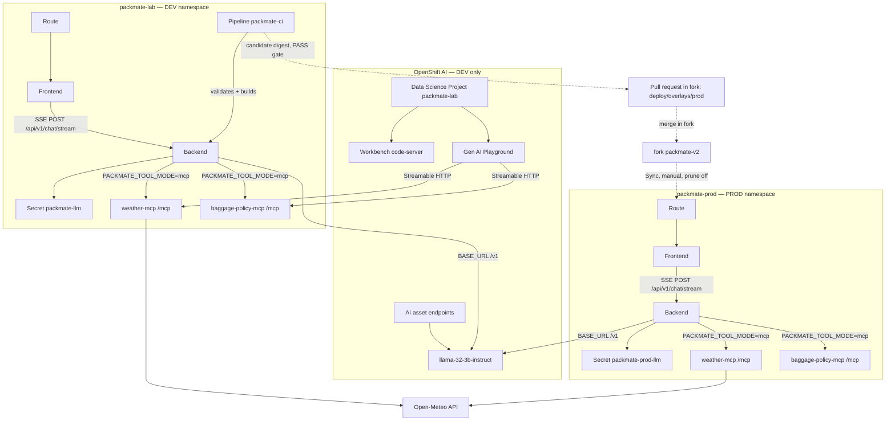

# Architecture

## Fork-first workshop model

| Layer | Role |
|-------|------|
| Canonical upstream | `Lindagh1/packmate-agent` @ `packmate-v2` / `lab-v2.0.0` — immutable workshop source |
| Participant fork | Writable Git history for Pipeline clones and promotion PRs |
| Argo CD | `Application/packmate-lab` and `Application/packmate-prod` use `GIT_REPO_URL` + `GIT_REVISION` from the fork |
| Release policy | New `lab-v2.x` only when the workshop itself changes — not per demo |
| Pre-bootstrap check | `make verify-demo-fork` — Argo upstream residue is INFO until bootstrap migrates |
| Post-bootstrap check | `make verify-demo-fork-live` — Applications must follow fork; DEV Synced/Healthy |
| Residue / reset | `make discover-packmate-resources` + dry-run `make reset-lab` |

Validated technical workflow:

**Playground → DEV → Tekton → durable GHCR candidate → PR in fork → Argo CD manual PROD Sync → verified PROD**

## Lab pedagogy (150 minutes, DEV → PROD)

Two namespaces on the same cluster:

| Environment | Namespace | Role |
|-------------|-----------|------|
| **DEV** | `packmate-lab` | Data Science Project: Workbench, Playground, AI asset endpoints, Pipeline `packmate-ci`, app workloads for experimentation |
| **PROD** | `packmate-prod` | Runtime-only: app workloads deployed exclusively by Argo CD Sync — no Workbench, Pipeline, Playground, or custom model endpoint |

| Layer | Examples |
|-------|----------|
| Participant ClickOps | Data Science Project (DEV), Workbench, AI asset endpoints, Playground, Pipeline Start, promotion PR review/merge, Argo Sync (PROD) |
| `make bootstrap` | Prerequisites only for Git-tracked runtime: Secrets (idempotent), custom model endpoint, MCP registration, Tekton Pipeline, AppProject/Applications. **Argo CD Application `packmate-lab` reconciles `deploy/overlays/dev`**. Also **prepares** PROD (namespace, Secret, image-pull RBAC, Applications) without deploying or syncing PROD workloads |
| `make promote PIPELINERUN=<name>` | Reads a Succeeded PipelineRun + PASS quality gate in DEV, edits **only** the backend digest in `deploy/overlays/prod/kustomization.yaml`, opens a pull request — never applies to the cluster. Exits early with `BLOCKED_NO_PROMOTION_DIFF` when PROD already equals the candidate. |
| `scripts/verify-demo-baseline.sh` / `prepare-demo-baseline.sh` | Read-only check / fork-only demo PROD baseline reset so repeated demos always have a promotion diff |
| Argo CD | Application `packmate-lab` (automated, prune off, selfHeal off) owns DEV runtime; Application `packmate-prod` (manual Sync, prune off, selfHeal off) is the **only** thing that deploys to PROD |
| Platform prerequisites | OpenShift AI, Pipelines, OpenShift GitOps, shared Llama in `my-first-model`, prebuilt images |

Playground = **model + system prompt + MCP**, DEV only.
FastAPI Packmate = Playground idea **industrialized** (Pydantic validation, MCP cache, bounded LLM retry, SSE + heartbeats, metrics, NetworkPolicies), running in both DEV and PROD.

## Runtime components (OpenShift AI–centered)

## Tool modes

| Mode | When | Weather / baggage | Traveler profile |
|------|------|-------------------|------------------|
| `local` (default for tests) | Unit tests, laptop/Workbench without MCP pods | In-process Python | Always local |
| `mcp` (OpenShift ConfigMap default) | Cluster deploy | Streamable HTTP MCP servers | Always local (never shared MCP) |

## Agent loop

1. Receive chat request + optional traveler profile (sanitized for LLM)
2. Call tools: `get_weather`, `baggage_rules` (maps to MCP tools in mcp mode), `traveler_profile` (local only)
3. Ask model for structured PackingResponse JSON
4. Parse + validate with Pydantic
5. Deterministically enrich baggage warnings, privacy filters, daily forecast, category order
6. Return response

## Chat transport (sync vs streaming)

| Endpoint | Used by | Purpose |
|----------|---------|---------|
| `POST /api/v1/chat` | Tests, evals, in-cluster scripts | Single JSON response (`PackingResponse`) |
| `POST /api/v1/chat/stream` | Public React UI | SSE with `started` / `progress` / `heartbeat` / `completed` / `error` |

On AWS Classic ELB sandboxes the **idle** timeout is ~60s (no bytes on the wire). That is different from the Route/Nginx **total** timeout (180s). Streaming sends heartbeats at least every 10s so long agent runs stay alive without raising the ELB idle setting.

SSE never streams: model chain-of-thought, `<think>` tags, medical notes, raw tool payloads, stack traces, or credentials.

## OpenShift AI lab path (DEV)

1. Data Science Project (`packmate-lab`) + Workbench
2. Discover model in AI asset endpoints (`my-first-model`, shared)
3. Deploy/register MCP servers (`gen-ai-aa-mcp-servers` ConfigMap — admin)
4. Prototype in Gen AI Playground → export
5. Integrate into FastAPI + React (DEV Route)
6. Level 1 deterministic evals (+ optional TrustyAI/EvalHub)
7. Pipeline `packmate-ci` **validates only** (tests + AI quality gate + manifest checks) and builds the backend — it never deploys anywhere

## Delivery: Pipeline validates, PR promotes, Argo deploys PROD

```mermaid
flowchart LR
  Start[Participant: Start Pipeline] --> Tekton[Tekton packmate-ci: clone, test, ai-quality-gate, validate-manifests, build-backend]
  Tekton -->|"PASS + digest"| Candidate[Candidate backend digest in packmate-lab ImageStream]
  Candidate --> Promote[make promote with PipelineRun evidence]
  Promote --> PR[Pull request: deploy/overlays/prod/kustomization.yaml only]
  PR -->|human review + merge| Git[packmate-v2]
  Git --> ArgoProd[Argo CD Application packmate-prod: OutOfSync]
  ArgoProd -->|manual Sync, prune=false, selfHeal=false| Prod[packmate-prod workloads]
```

The Pipeline **never** deploys to `packmate-prod` (guarded by `validate-manifests`, which fails the run on any `oc apply … packmate-prod` / `oc set image` / `argocd sync` string in `.tekton/lab/`). Argo CD Sync is the only path that changes PROD Deployments. MCP servers version via Deployment image digests in each overlay (not Rollouts by default); an optional canary annex for the backend Deployment exists under `deploy/overlays/prod-canary-annex/` and is not part of the graded path.

## Privacy boundaries

- Medical / accessibility notes stay in-app; never sent to MCP servers
- Logs and OTel spans never include message bodies or notes
- Baggage rules always include the demonstration disclaimer

## Observability

- `/metrics` Prometheus exposition
- Optional OTLP traces (including `mcp.call_tool` spans)
- `/health` and `/ready` on app and MCP servers

## GitOps dual applications

AppProject `packmate` destinations: `packmate-lab` (DEV overlay) and `packmate-prod` (PROD overlay). Tekton builds internally, publishes a durable GHCR candidate, then a PR updates PROD; Argo CD Sync applies PROD.
