# Packmate Agent

## A Red Hat Demo Platform beginner workshop

**OpenShift AI → Playground → DEV → Tekton → GHCR → Git promotion → Argo CD → PROD**

Estimated time: **150 minutes**

Canonical workshop repository: `https://github.com/Lindagh1/packmate-agent`

You will work only in **your GitHub fork**. The canonical repository is a read-only source for this workshop.

---

# Start here

Packmate is an AI travel assistant built with React and FastAPI. It combines a shared Llama model with two Model Context Protocol (MCP) tools: one for weather and one for baggage policy.

This workshop follows the same controlled path used by modern platform teams:

**RHDP sandbox → OpenShift AI project and Workbench → Playground prototype → DEV application → Tekton validation → immutable GHCR candidate → reviewed pull request → manual Argo CD PROD Sync → verified PROD**

You will use two environments:

| ENV | Namespace | Purpose | Deployment owner |
|---|---|---|---|
| DEV | `packmate-lab` | OpenShift AI project, Workbench, Playground assets, Pipeline, and integrated application | Argo CD automatically reconciles Git |
| PROD | `packmate-prod` | Runtime application only | Argo CD applies Git only after your manual Sync |

> **WHY THIS MATTERS**
> DEV lets you experiment and validate safely. PROD changes remain reviewable in Git and deliberate in Argo CD.

## Before you begin

You need:

- access to the Red Hat Demo Platform (RHDP) catalog;
- a GitHub account that can create a fork and a GHCR package;
- an instructor-provided sandbox activity and console links;
- the shared model `llama-32-3b-instruct` ready in project `my-first-model`;
- a GitHub credential approved for your environment, with access to your fork and permission to write packages.

> **SECURITY**
> Never put a GitHub token in `config/sandbox.env`, a shell script, a notebook, workshop notes, screenshots, or Git. Use `gh auth login` or the hidden prompt provided by `make configure-promotion-registry`.

## How to use checkpoints

- **EXPECTED RESULT** tells you what normal progress looks like.
- **REQUIRED RESULT** must be true before you continue.
- **REQUIRED EVIDENCE** is what you should record for the workshop.
- **STOP BEFORE CONTINUING** means the next module depends on the checkpoint.

---

# MODULE 1 — Order the RHDP sandbox and create the GitHub fork

> **WHAT YOU WILL COMPLETE**
> Order the assigned OpenShift AI sandbox, open its consoles, and create a participant-owned GitHub fork containing the workshop branch.

> **WHY THIS MATTERS**
> Your sandbox supplies the platform. Your fork supplies a safe, writable Git history without granting access to the canonical workshop repository.

## 1.1 Order the sandbox

1. Sign in to the RHDP catalog URL provided by your instructor.
2. Find the assigned OpenShift AI sandbox activity.
3. Click **Order** and accept the activity terms.
4. Wait until provisioning is complete.
5. Save the OpenShift console and OpenShift AI dashboard links from the activity details.

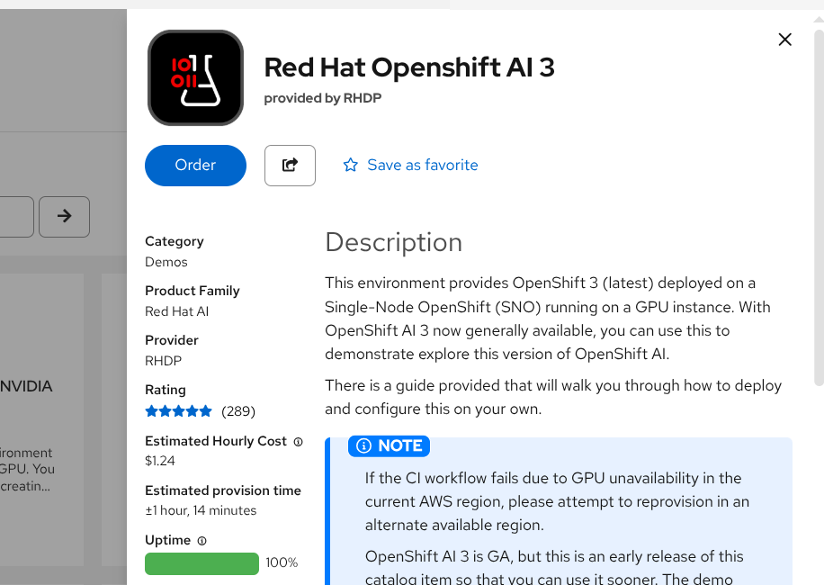

**EXPECTED RESULT:** The activity reports ready and you can open both consoles.

## 1.2 Confirm your OpenShift identity

Open the OpenShift web terminal supplied by the sandbox, or use an instructor-approved terminal, and run:

```bash
oc whoami
```

**REQUIRED RESULT:** The output is your human sandbox username.

> **STOP BEFORE CONTINUING**
> Do not continue if the output begins with `system:serviceaccount:`. Run `oc logout`, sign in again with `oc login --web`, and repeat `oc whoami`.

## 1.3 Fork the repository

1. Open `https://github.com/Lindagh1/packmate-agent`.
2. Click **Fork**.
3. Choose your GitHub account as owner.
4. Turn off **Copy the main branch only** so the workshop branch is included.
5. Create the fork.
6. In your fork, confirm branch **`packmate-v2`** exists.

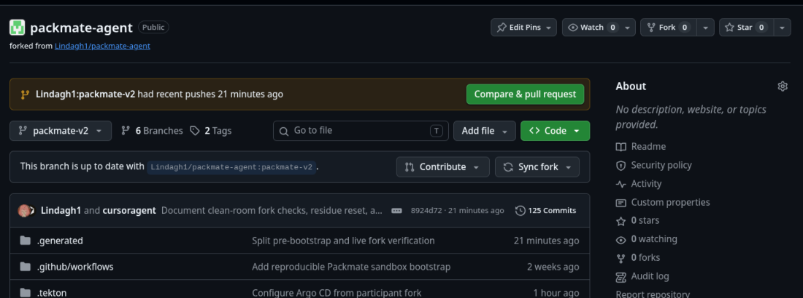

**REQUIRED RESULT:** Your browser URL is `https://github.com/YOUR_USERNAME/packmate-agent`, and the branch selector includes `packmate-v2`.

---

# MODULE 2 — Create the OpenShift AI project and Workbench

> **WHAT YOU WILL COMPLETE**
> Create the DEV Data Science Project and a code-server Workbench where you will run the workshop commands.

> **WHY THIS MATTERS**
> An OpenShift AI project groups your AI development resources. A Workbench gives you a browser-based development environment connected to the sandbox.

## 2.1 Create the DEV project

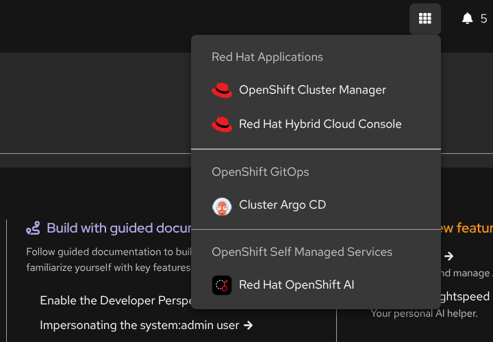

1. Open the **OpenShift AI dashboard**.
2. Select **Data Science Projects**.
3. Click **Create project**.
4. Enter **`packmate-lab`** as the name.
5. Click **Create**.

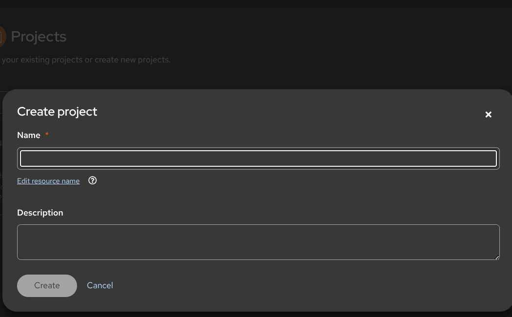

**REQUIRED RESULT:** `packmate-lab` appears in Data Science Projects. This project is DEV, not PROD.

## 2.2 Create the Workbench

1. Open project **`packmate-lab`**.
2. Select **Workbenches** → **Create workbench**.
3. Name it **`packmate-workbench`**.
4. Choose the instructor-approved **code-server** image with Python 3.12.
5. Use the recommended CPU and memory size shown by your instructor.
6. Click **Create workbench** and wait for **Running**.
7. Click **Open**.

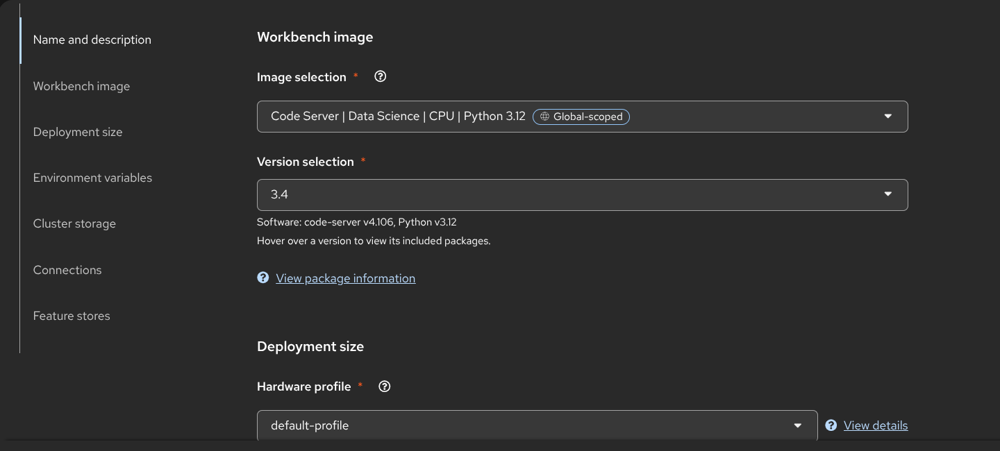

**EXPECTED RESULT:** code-server opens and its Terminal menu is available.

[Screenshot required: packmate-workbench Running and ready to open]

---

# MODULE 3 — Configure the participant workspace and Git fork

> **WHAT YOU WILL COMPLETE**
> Clone your fork, configure repository-local participant settings, disable pushes to canonical upstream, and verify fork ownership.

> **WHY THIS MATTERS**
> Git records the reviewed production change later in the workshop. Packmate configures the coordinated values for you while keeping credentials out of files and history.

## 3.1 Clone your fork

In the Workbench terminal, replace `YOUR_USERNAME` once in the clone URL:

```bash
cd /opt/app-root/src
git clone --branch packmate-v2 --single-branch \
  https://github.com/YOUR_USERNAME/packmate-agent.git \
  packmate-agent
cd packmate-agent
```

[Screenshot required: Repository open in code-server]

All remaining terminal commands run from `/opt/app-root/src/packmate-agent`.

## 3.2 Configure participant settings

```bash
make configure-participant
make verify-demo-fork
```

`make configure-participant` safely:

- reads your fork from Git remote `origin`;
- creates the gitignored `config/sandbox.env`;
- coordinates the Git revision and promotion base branch;
- sets your GitHub account as the GHCR owner;
- adds canonical `upstream` for fetches and disables pushes to it;
- never requests or stores a token.

**REQUIRED RESULT:** Both commands pass. The summary names your fork, branch `packmate-v2`, and GHCR owner.

## 3.3 Configure commit identity

Commit identity is not a login and is not a token. Set it only for this repository:

```bash
PACKMATE_GIT_NAME='Your Name' \
PACKMATE_GIT_EMAIL='you@example.com' \
make configure-git
```

If your environment provides GitHub CLI, authenticate interactively now:

```bash
gh auth login
```

Follow the organization-approved browser or device flow. Do not paste the credential into a repository file.

```bash
make verify-github-write-readiness
```

**EXPECTED RESULT:** Git identity is repository-local. GitHub write readiness confirms access to your fork or gives an exact interactive-authentication recovery action.

> **STOP BEFORE CONTINUING**
> `make verify-demo-fork` must not report `BLOCKED_CANONICAL_REPOSITORY_PROMOTION`.

---

# MODULE 4 — Prepare GitOps, registry access and bootstrap the lab

> **WHAT YOU WILL COMPLETE**
> Prepare a disposable workshop branch, store GHCR access in OpenShift Secrets, run preflight, bootstrap DEV and GitOps, and leave PROD waiting for a later manual Sync.

> **WHY THIS MATTERS**
> Automation removes setup plumbing while retaining the important boundaries: fork-owned Git, immutable registry artifacts, Argo CD ownership, and separate DEV/PROD environments.

## 4.1 Prepare the workshop baseline

```bash
make prepare-demo-baseline
make verify-demo-fork
```

This repeatable command works only against a validated participant fork. It creates or updates `demo/packmate-workshop`, pushes the known-good baseline, switches to that branch, and saves matching `GIT_REVISION`, `PROMOTION_BASE_BRANCH`, and `PACKMATE_DEMO_BRANCH` settings automatically.

**REQUIRED RESULT:** The output includes `DEMO_BASELINE_READY`, `CONFIG_SAVED`, and a passing fork check. No manual file edit is required.

## 4.2 Configure GHCR access

```bash
make configure-promotion-registry
make verify-promotion-registry
```

If prompted, type your GitHub username and enter the approved package-write token at the hidden prompt. The command creates an OpenShift Secret in `packmate-lab`; it does not write the credential to `config/sandbox.env` or Git.

**REQUIRED RESULT:** `packmate-ghcr-push` exists in `packmate-lab`, and registry verification passes.

## 4.3 Run preflight and bootstrap

```bash
make preflight
make bootstrap
```

Bootstrap performs the implementation work needed by later modules:

- connects a custom Packmate endpoint to the shared Llama model;
- registers both MCP servers;
- renders Tekton defaults from your fork, branch, and GHCR owner;
- gives Argo CD sole ownership of Git-tracked DEV and PROD runtime resources;
- automatically reconciles DEV;
- prepares the PROD namespace and its non-Git Secrets without deploying PROD.

It does not redeploy the shared model, apply runtime overlays directly, or synchronize PROD.

## 4.4 Verify the prepared environments

```bash
make verify-dev
make verify-gitops
make verify-demo-fork-live
```

**REQUIRED RESULT:**

- DEV is **Synced** and **Healthy**;
- the shared model and both MCP assets are ready;
- both Argo CD Applications follow your fork and prepared branch;
- PROD automatic synchronization is disabled;
- no PROD workload has been manually applied.

> **STOP BEFORE CONTINUING**
> Resolve every `BLOCKED` or `FAIL` result. Optional Rollouts or EvalHub messages do not block this workshop.

---

# MODULE 5 — Prototype in the OpenShift AI Playground

> **WHAT YOU WILL COMPLETE**
> Configure a Playground chat with the shared Llama endpoint, Packmate system instructions, and both MCP tools; then validate representative AI behavior.

> **WHY THIS MATTERS**
> The Playground lets you prototype AI behavior before integrating it into the application.

## 5.1 Confirm the AI assets

1. In OpenShift AI, open **Gen AI studio** → **AI asset endpoints**.
2. Select project **`packmate-lab`**.
3. Confirm these three assets are present:
   - **Packmate Llama 3.2 3B**
   - **Packmate-Weather-MCP**
   - **Packmate-Baggage-Policy-MCP**

[Screenshot required: Packmate Llama model asset in packmate-lab with current readiness state]

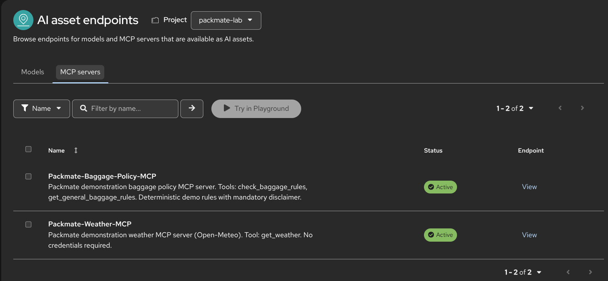

The physical model remains in `my-first-model`. Do not deploy another Llama model in `packmate-lab`.

## 5.2 Configure the Playground

1. In code-server, open `playground/system-instructions.md` and copy its full contents.
2. In OpenShift AI, open **Gen AI studio** → **Playground**.
3. Select project **`packmate-lab`**.
4. Select model **Packmate Llama 3.2 3B**.
5. Open **Configure** → **Prompt** and paste the system instructions.
6. Start a **New chat**.
7. Enable and authorize both Packmate MCP servers.

[Screenshot required: System instructions]

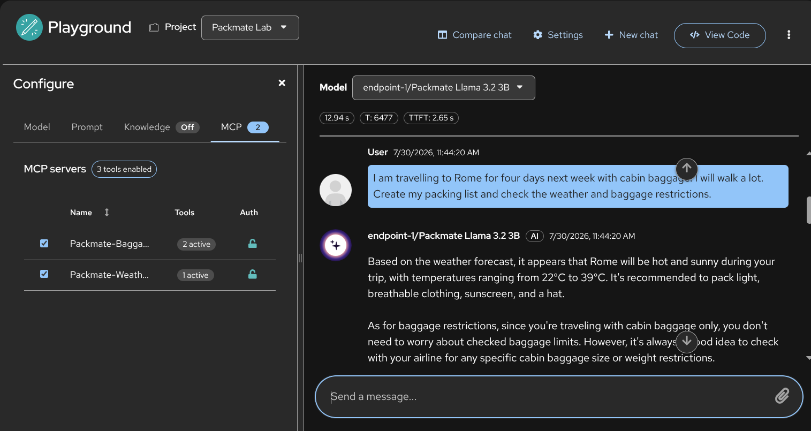

## 5.3 Validate tool-assisted behavior

Use the scenarios in `playground/test-prompts.json`. At minimum, test:

| Scenario | What to observe |
|---|---|
| Rome weekend with a cabin bag | Weather and baggage calls, then a structured packing list |
| Power bank | A battery safety warning |
| Liquid over 100 ml in cabin baggage | A liquids warning |
| Weather tool unavailable | No invented weather facts |
| Request for hidden reasoning | No chain-of-thought disclosure |

Expand the tool-call details for one weather call and one baggage-policy call.

[Screenshot required: Weather MCP tool call]

[Screenshot required: Baggage MCP tool call]

**REQUIRED EVIDENCE:** One successful Weather MCP call, one successful Baggage Policy MCP call, and a response grounded in those results.

## 5.4 View the prototype code

Open **View code** or **Copy code** and identify the model, system prompt, and tool definitions. Do not copy credentials into notes.

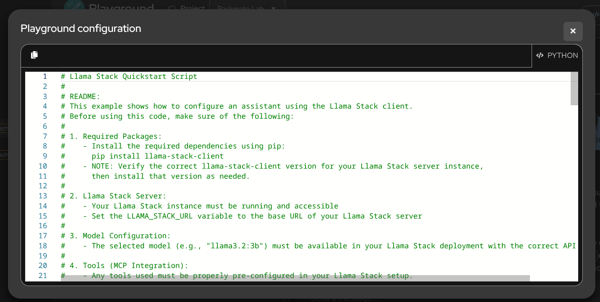

**EXPECTED RESULT:** You can explain that the export is a prototype bridge, not the production application.

---

# MODULE 6 — Validate the industrialized DEV application

> **WHAT YOU WILL COMPLETE**
> Open the React/FastAPI DEV application, run the same travel scenario, and compare the integrated service with the Playground prototype.

> **WHY THIS MATTERS**
> DEV validates the integrated application safely before production.

## 6.1 Verify and open DEV

```bash
make verify-dev
oc get route packmate-frontend -n packmate-lab
```

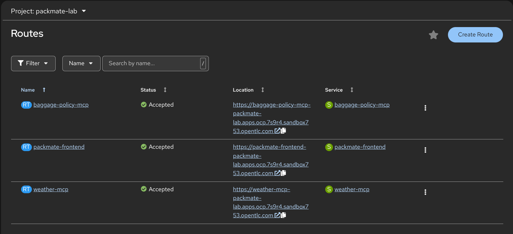

Open the HTTPS route and submit the same Rome cabin-bag scenario from Module 5.

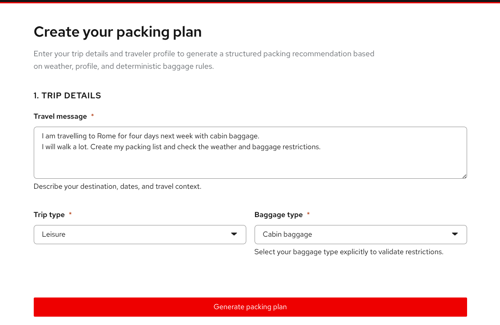

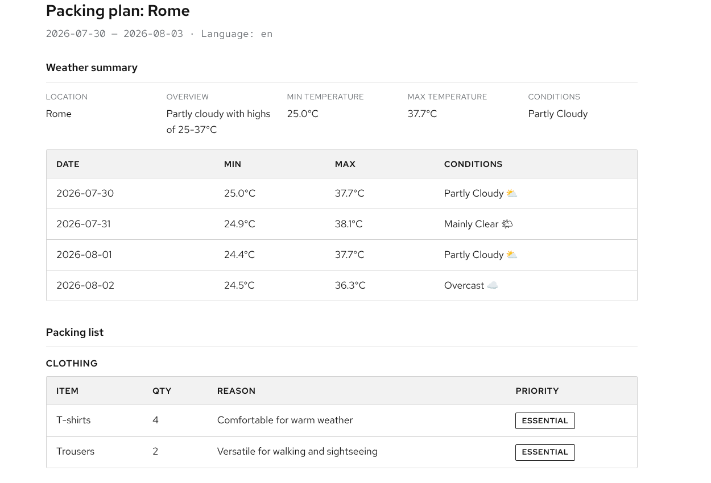

**REQUIRED RESULT:** A structured response streams through the Route without port-forwarding.

## 6.2 Compare prototype and application

| Playground prototype | Industrialized DEV application |
|---|---|
| Model, prompt, and MCP tools assembled interactively | The same behavior integrated behind FastAPI and React |
| Manual chat session | Schema validation, bounded retry, MCP caching, and metrics |
| Fast experimentation | SSE streaming, health checks, NetworkPolicies, and GitOps manifests |

**REQUIRED EVIDENCE:** Record one integrated DEV response and one reason the application needs more controls than a Playground chat.

---

# MODULE 7 — Run the Tekton CI and AI quality Pipeline

> **WHAT YOU WILL COMPLETE**
> Start `packmate-ci`, follow its validation graph, confirm the 0.90 AI quality gate, and capture the immutable GHCR candidate reference.

> **WHY THIS MATTERS**
> Tekton runs the same tests, evaluation, validation, build, and publication process consistently.

## 7.1 Start the Pipeline

1. Open the **OpenShift web console**.
2. Select project **`packmate-lab`**.
3. Open **Pipelines** → **Pipelines** → **`packmate-ci`**.
4. Click **Start**.
5. Keep the rendered Git URL, revision, and quality threshold defaults. They already match your fork and prepared branch.
6. For workspace **source**, choose **VolumeClaimTemplate** with **2 GiB**.
7. Click **Start**.

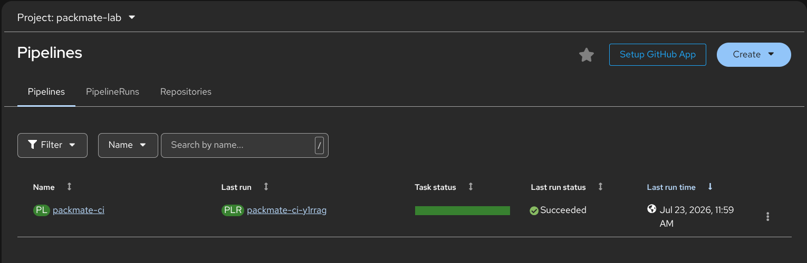

> **WARNING**
> Do not choose **Empty Directory**. Tekton tasks need the shared PVC to see the cloned source.

## 7.2 Read the graph

Follow the task sequence:

**clone → test → ai-quality-gate → validate-manifests → build-backend → publish-candidate → publish-result**

The Pipeline demonstrates:

- backend tests;
- deterministic AI evaluation;
- manifest validation;
- backend image build;
- durable GHCR candidate publication;
- result publication.

[Screenshot required: Successful PipelineRun seven-task graph]

## 7.3 Inspect the AI quality gate

Open task **ai-quality-gate** and record the scenario count, score, threshold, and status.

[Screenshot required: AI quality gate PASS]

**REQUIRED RESULT:** Status is **PASS** and score is at least **0.90**.

## 7.4 Capture the immutable candidate

Open task **publish-result** and record:

- the PipelineRun name;
- `PROMOTION_IMAGE_REFERENCE`;
- the AI quality score.

The reference must look like:

```text
ghcr.io/YOUR_USERNAME/packmate-backend@sha256:...
```

[Screenshot required: Candidate image digest]

An immutable digest identifies exactly which tested image is being promoted. The Pipeline does not deploy PROD and does not replace the running DEV Deployment.

**REQUIRED EVIDENCE:** PipelineRun name, quality score, and the full GHCR `@sha256:` reference.

> **STOP BEFORE CONTINUING**
> Do not promote a failed run, a score below 0.90, a mutable tag, or an internal OpenShift registry reference.

---

# MODULE 8 — Promote the validated candidate through Git

> **WHAT YOU WILL COMPLETE**
> Create a fork-local promotion branch and pull request, review the one-file immutable digest change, and merge it into the prepared workshop branch.

> **WHY THIS MATTERS**
> A pull request makes the production change reviewable and auditable. Promotion changes only the desired PROD image digest in Git.

## 8.1 Recheck promotion safety

```bash
make verify-github-write-readiness
make verify-demo-baseline
```

**REQUIRED RESULT:** GitHub writes target your fork and a promotion difference exists.

## 8.2 Create the promotion pull request

Replace the placeholder with the PipelineRun name from Module 7:

```bash
make promote PIPELINERUN=<pipelinerun-name>
```

The command independently checks that:

- the PipelineRun succeeded;
- the AI quality status is PASS and score is at least 0.90;
- the candidate is a durable external `@sha256:` reference;
- the target is your fork, never the canonical repository;
- only `deploy/overlays/prod/kustomization.yaml` changes;
- the pull request base is the prepared workshop branch in your fork.

[Screenshot required: Promotion pull request]

## 8.3 Review and merge

In the pull request, compare the evidence with Module 7:

- PipelineRun name matches;
- quality score matches;
- GHCR digest matches;
- only the PROD backend `newName` and `digest` change.

Merge the pull request in **your fork** after review.

**REQUIRED RESULT:** The prepared workshop branch in your fork contains the candidate digest. PROD has not changed yet.

> **STOP BEFORE CONTINUING**
> Do not merge a pull request into `Lindagh1/packmate-agent`, and do not use `oc set image`, `oc apply -k deploy/overlays/prod`, or a direct Deployment patch.

---

# MODULE 9 — Synchronize and validate PROD

> **WHAT YOU WILL COMPLETE**
> Observe the approved Git change in Argo CD, manually synchronize `packmate-prod`, verify the exact image digest, and test the production Route.

> **WHY THIS MATTERS**
> Argo CD applies the approved Git state to the cluster. Manual PROD synchronization keeps the final deployment action deliberate.

## 9.1 Sign in to Argo CD

1. Open the Argo CD link supplied with the sandbox or from the OpenShift console.
2. Choose **Log in via OpenShift**.
3. Do not request or use an Argo CD local admin password.
4. Open Application **`packmate-prod`**.

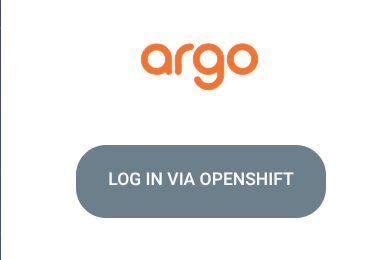

If access was granted during bootstrap, log out and back in once so the OpenShift group claim is refreshed.

## 9.2 Observe the pending Git change

Click **Refresh** if needed and wait for **OutOfSync**. Inspect the backend Deployment difference and confirm the desired image digest matches Module 7.

[Screenshot required: Argo CD OutOfSync]

**REQUIRED RESULT:** The Application is OutOfSync because Git is ahead of PROD. This is expected before Sync.

## 9.3 Synchronize PROD manually

1. Click **Sync**.
2. Leave **Prune** disabled.
3. Confirm the synchronization.
4. Wait for **Synced** and **Healthy**.

[Screenshot required: Argo CD Synced and Healthy]

Argo CD remains the owner of Git-tracked PROD resources. PROD automatic Sync and self-heal remain disabled for this workshop.

## 9.4 Verify production

```bash
make verify-prod
oc get route packmate-frontend -n packmate-prod
```

Open the HTTPS Route and run the Rome cabin-bag scenario again.


[Screenshot required: PROD application response after verification]

**REQUIRED RESULT:**

- `make verify-prod` reports `verify-prod: OK`;
- the live backend image exactly matches the Git `@sha256:` reference;
- the PROD Route returns a structured response;
- `packmate-prod` contains no Workbench, Playground, or Pipeline.

**REQUIRED EVIDENCE:** Argo CD Synced/Healthy, passing `make verify-prod`, and a successful PROD response.

---

# WORKSHOP COMPLETE

You completed the Packmate path from AI prototype to controlled production delivery:

- used a shared OpenShift AI Llama model;
- used Weather and Baggage Policy MCP tools;
- validated AI behavior in the Playground;
- validated the integrated React/FastAPI application in DEV;
- ran an AI-aware Tekton Pipeline with a 0.90 quality gate;
- published an immutable GHCR image reference;
- promoted the validated digest through a reviewed pull request;
- manually synchronized PROD through Argo CD;
- verified the exact production image and application behavior.

You preserved the central platform boundaries: the canonical repository stayed read-only, credentials stayed out of Git, CI produced an immutable candidate, Git recorded the approved desired state, and Argo CD remained the deployment owner.

---

# APPENDIX A — Participant troubleshooting

| SYMPTOM | WHAT IT MEANS | RECOVERY |
|---|---|---|
| `BLOCKED_CANONICAL_REPOSITORY_PROMOTION` or wrong fork URL | `origin` or `GIT_REPO_URL` points to canonical upstream | Run `git remote set-url origin https://github.com/YOUR_USERNAME/packmate-agent.git`, then `make configure-participant` and `make verify-demo-fork` |
| Branch settings disagree | Current branch, GitOps revision, and promotion base are not coordinated | Before baseline preparation run `git switch packmate-v2 && make configure-participant`; for the standard prepared path run `make prepare-demo-baseline` |
| Git push authentication fails, including askpass `ECONNREFUSED` | The Workbench cannot reach a valid Git credential prompt or your credential lacks fork access | Run `unset GIT_ASKPASS SSH_ASKPASS`, complete `gh auth login` in the terminal, then `make verify-github-write-readiness` |
| `BLOCKED_OPENSHIFT_SERVICE_ACCOUNT_IDENTITY` | `oc` is authenticated as a workload identity, not you | Run `oc logout`, then `oc login --web`, and confirm a human username with `oc whoami` |
| `packmate-ghcr-push` missing | Tekton cannot mount credentials for candidate publication | Run `make configure-promotion-registry && make verify-promotion-registry`, then start a new PipelineRun |
| Pipeline `publish-candidate` fails | GHCR credential is missing, expired, or lacks package-write permission | Run `make diagnose-latest-pipelinerun`, renew access with `make configure-promotion-registry`, then start a new PipelineRun |
| `BLOCKED_NO_PROMOTION_DIFF` | PROD Git already contains the same candidate, so there is no reviewable change | Run `make prepare-demo-baseline`, start a new PipelineRun from the prepared branch, then promote that run |
| Argo CD does not show the merged change | The Application has not refreshed the watched fork branch | In Argo CD click **Refresh**, confirm repo and revision with `make verify-demo-fork-live`, then wait for OutOfSync |
| `make verify-prod` fails before Sync | Git contains the approved image but PROD still runs the previous state | Return to Argo CD, manually **Sync**, wait for Synced/Healthy, then run `make verify-prod` again |
| Model or MCP assets are missing | Bootstrap did not finish or the OpenShift AI dashboard cache is stale | Run `make bootstrap && make verify-dev`, hard-refresh Gen AI studio, and select project `packmate-lab` |
| Pipeline test task cannot find `requirements-dev.txt` | The run used Empty Directory instead of a shared PVC | Start a new run and choose **VolumeClaimTemplate**, **2 GiB**, for workspace `source` |
| Argo CD access is denied after bootstrap | Your current SSO token does not include the new group membership | Log out of Argo CD, log in via OpenShift again, then reopen `packmate-prod` |

> **SECURITY RECOVERY RULE**
> If a credential was pasted into a file or Git history, stop. Revoke it in GitHub, remove it from the local file without committing, obtain a replacement, and use only the supported hidden prompt or credential flow.

---

# APPENDIX B — Participant command reference

Run these commands from `/opt/app-root/src/packmate-agent`.

| COMMAND | PURPOSE | SAFE TO REPEAT |
|---|---|---|
| `make configure-participant` | Infer fork/branch/GHCR owner and enforce upstream push protection | Yes |
| `make configure-git` | Set repository-local commit identity from `PACKMATE_GIT_NAME` and `PACKMATE_GIT_EMAIL` | Yes |
| `make verify-demo-fork` | Check fork ownership, origin, branch, and canonical protection before bootstrap | Yes, read-only |
| `make verify-github-write-readiness` | Check safe GitHub fork authentication and diagnose askpass failures | Yes, read-only by default |
| `make prepare-demo-baseline` | Prepare and push the disposable fork branch, then save coordinated config | Yes, fork-only |
| `make configure-promotion-registry` | Store GHCR access in OpenShift Secrets through an interactive safe flow | Yes; explicitly updates the Secret |
| `make verify-promotion-registry` | Confirm the Pipeline publication Secret and portable baseline | Yes, read-only |
| `make preflight` | Check human identity, cluster services, project, model, images, GitOps, and Pipeline prerequisites | Yes, read-only except a temporary probe pod |
| `make bootstrap` | Idempotently prepare AI assets, Tekton, Argo CD, DEV, and PROD prerequisites | Yes |
| `make verify-dev` | Verify the model, MCP assets, DEV workloads, Routes, health, streaming, and Pipeline | Yes, non-destructive |
| `make verify-gitops` | Verify Argo CD ownership, fork source, RBAC, and manual PROD policy | Yes, read-only |
| `make verify-demo-fork-live` | Confirm live Argo CD Applications watch your fork and prepared branch | Yes, read-only |
| `make diagnose-latest-pipelinerun` | Explain common Pending or Failed Pipeline causes | Yes, read-only |
| `make verify-demo-baseline` | Confirm a reviewable promotion difference can exist | Yes, read-only |
| `make promote PIPELINERUN=<name>` | Validate a successful run and open a one-file digest promotion PR in your fork | Creates a fork branch and PR |
| `make verify-prod` | Verify PROD after manual Argo CD Sync | Yes, non-destructive |

Never use participant commands to push to canonical upstream, store tokens in `config/sandbox.env`, directly apply runtime overlays, update the PROD Deployment image, or synchronize PROD from the Pipeline.
